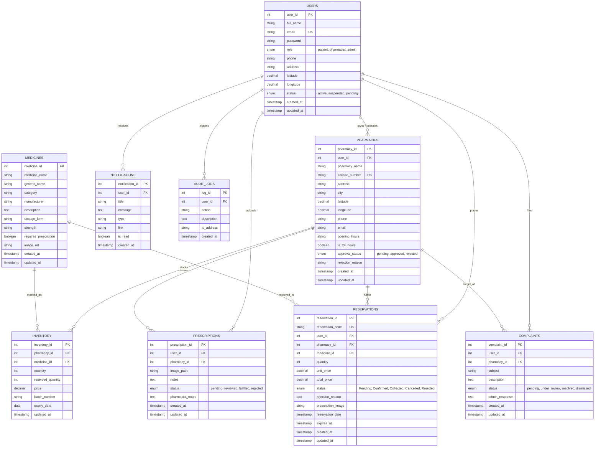

# MediFind Database Entity-Relationship Diagram (ERD) & Data Dictionary

**Project Title:** Design and Development of a Real-Time Medicine Availability and Pharmacy Locator System  
**Academic Level:** Bachelor of Information Technology Final-Year Capstone  
**Database Engine:** Relational MySQL 8.0 / MariaDB / SQLite  

---

## 1. Mermaid Entity-Relationship Diagram

---

## 2. Relational Schema Data Dictionary

### Table: `users`
Stores all platform actors with cryptographic credentials and role-based permissions.

| Column | Type | Constraints | Description |
| :--- | :--- | :--- | :--- |
| `user_id` | INT | PRIMARY KEY, AUTO_INCREMENT | Unique user identifier |
| `full_name` | VARCHAR(100) | NOT NULL | Full legal name of user |
| `email` | VARCHAR(120) | UNIQUE, NOT NULL | Login email address |
| `password` | VARCHAR(255) | NOT NULL | bcrypt password hash (Salt rounds = 10) |
| `role` | ENUM | 'patient', 'pharmacist', 'admin' | Role-based authorization tier |
| `phone` | VARCHAR(20) | NULL | Contact telephone number |
| `address` | VARCHAR(255) | NULL | Default physical residential address |
| `latitude` | DECIMAL(10,8)| NULL | User home GPS latitude |
| `longitude` | DECIMAL(11,8)| NULL | User home GPS longitude |
| `status` | ENUM | 'active', 'suspended', 'pending' | Account activation state |
| `created_at` | TIMESTAMP | DEFAULT CURRENT_TIMESTAMP | Registration timestamp |
| `updated_at` | TIMESTAMP | AUTO UPDATE | Last profile update timestamp |

### Table: `pharmacies`
Stores verified pharmacy dispensaries, geolocation coordinates, operating hours, and license credentials.

| Column | Type | Constraints | Description |
| :--- | :--- | :--- | :--- |
| `pharmacy_id` | INT | PRIMARY KEY, AUTO_INCREMENT | Unique dispensary identifier |
| `user_id` | INT | FOREIGN KEY (`users.user_id`) | Associated pharmacist account owner |
| `pharmacy_name`| VARCHAR(150)| NOT NULL | Commercial facility name |
| `license_number`| VARCHAR(100)| UNIQUE, NOT NULL | Official state/government pharmacy license |
| `address` | VARCHAR(255) | NOT NULL | Physical street address |
| `city` | VARCHAR(100) | NOT NULL | City or municipality |
| `latitude` | DECIMAL(10,8)| NOT NULL | Precise GPS latitude coordinate |
| `longitude` | DECIMAL(11,8)| NOT NULL | Precise GPS longitude coordinate |
| `phone` | VARCHAR(30) | NOT NULL | Dispensary counter hotline |
| `email` | VARCHAR(120) | NULL | Official inquiry email |
| `opening_hours`| VARCHAR(100)| NULL | e.g. "08:00 AM - 10:00 PM" |
| `is_24_hours` | BOOLEAN | DEFAULT FALSE | 24-hour round-the-clock indicator |
| `approval_status`| ENUM | 'pending', 'approved', 'rejected' | Administrator compliance clearance |
| `rejection_reason`| TEXT | NULL | Feedback note if registration declined |

### Table: `medicines`
Global master catalogue of standardized pharmaceutical drugs.

| Column | Type | Constraints | Description |
| :--- | :--- | :--- | :--- |
| `medicine_id` | INT | PRIMARY KEY, AUTO_INCREMENT | Global drug identifier |
| `medicine_name`| VARCHAR(150)| NOT NULL | Commercial brand name (e.g. Augmentin) |
| `generic_name` | VARCHAR(150)| NULL | Active pharmaceutical ingredient |
| `category` | VARCHAR(100) | NOT NULL | Drug therapeutic class (e.g. Antibiotics) |
| `manufacturer` | VARCHAR(120) | NOT NULL | Pharmaceutical manufacturing firm |
| `description` | TEXT | NULL | Clinical indications and warnings |
| `dosage_form` | VARCHAR(50) | NOT NULL | Tablet, Capsule, Syrup, Inhaler, etc. |
| `strength` | VARCHAR(50) | NULL | Milligram strength (e.g. 500mg) |
| `requires_prescription` | BOOLEAN | DEFAULT FALSE | Prescription mandate indicator |

### Table: `inventory`
Real-time stock quantities and prices maintained by each pharmacy.

| Column | Type | Constraints | Description |
| :--- | :--- | :--- | :--- |
| `inventory_id` | INT | PRIMARY KEY, AUTO_INCREMENT | Unique inventory record identifier |
| `pharmacy_id` | INT | FOREIGN KEY (`pharmacies.pharmacy_id`)| Stocking dispensary |
| `medicine_id` | INT | FOREIGN KEY (`medicines.medicine_id`)| Stocked medication |
| `quantity` | INT | NOT NULL, CHECK (>= 0) | Physical stock units in drawer |
| `reserved_quantity`| INT | DEFAULT 0, CHECK (>= 0) | Locked units held in active reservations |
| `price` | DECIMAL(10,2)| NOT NULL, CHECK (> 0) | Retail unit price in USD |
| `batch_number` | VARCHAR(50) | NULL | Batch production identifier |
| `expiry_date` | DATE | NOT NULL | Shelf expiration date |

> **Calculated Dynamic Field:**
> `available_stock` = `quantity` - `reserved_quantity`

### Table: `reservations`
Patient medicine holds locking stock quantities with verification vouchers.

| Column | Type | Constraints | Description |
| :--- | :--- | :--- | :--- |
| `reservation_id`| INT | PRIMARY KEY, AUTO_INCREMENT | Unique reservation record |
| `reservation_code`| VARCHAR(30)| UNIQUE, NOT NULL | Human-readable voucher code (`RES-2024-XXXX`)|
| `user_id` | INT | FOREIGN KEY (`users.user_id`) | Patient placing the hold |
| `pharmacy_id` | INT | FOREIGN KEY (`pharmacies.pharmacy_id`)| Target dispensary |
| `medicine_id` | INT | FOREIGN KEY (`medicines.medicine_id`)| Medication reserved |
| `quantity` | INT | NOT NULL | Number of units held |
| `unit_price` | DECIMAL(10,2)| NOT NULL | Unit price at time of reservation |
| `total_price` | DECIMAL(10,2)| NOT NULL | Total reservation payable amount |
| `status` | ENUM | 'Pending', 'Confirmed', 'Collected', 'Cancelled', 'Rejected' | State in lifecycle |
| `rejection_reason`| TEXT | NULL | Stated reason on cancellation/rejection |
| `prescription_image`| VARCHAR(255)| NULL | Attached Rx document reference |
| `expires_at` | TIMESTAMP | NOT NULL | Reservation expiration deadline (default 24h) |
